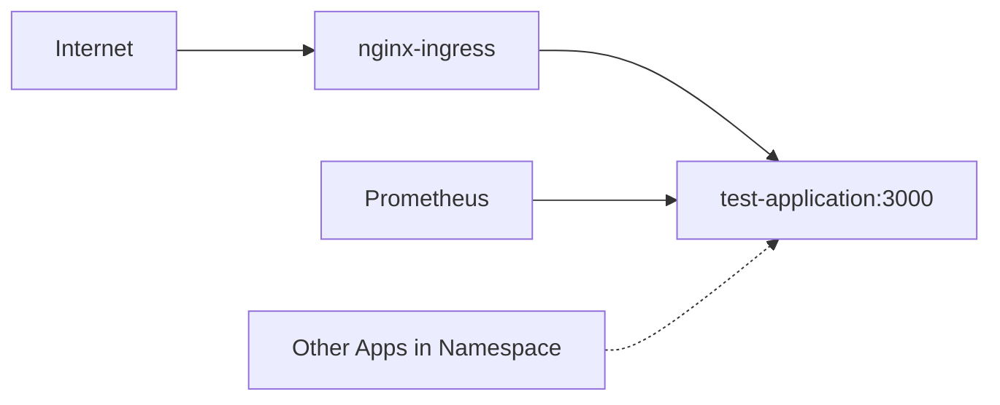
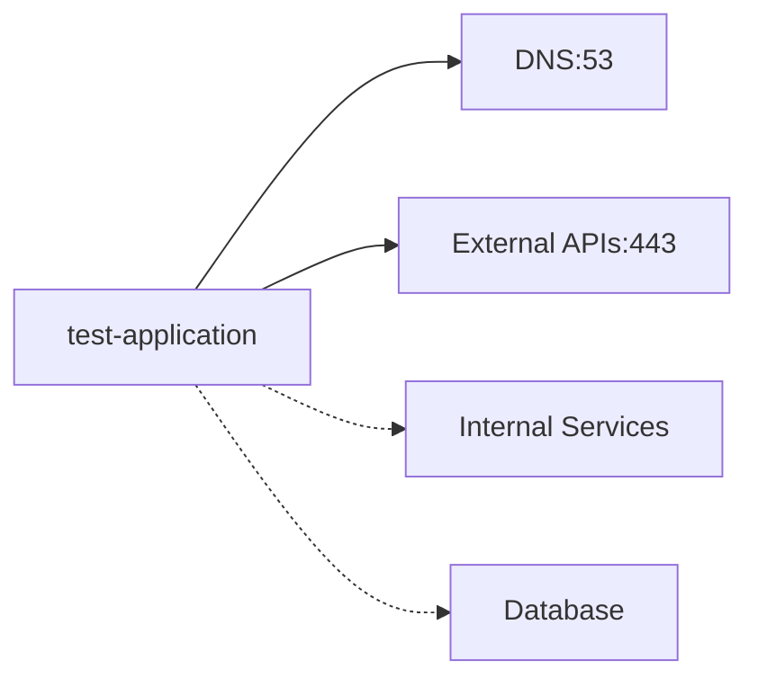

# Network Policy Configuration Guide

This document explains how the `test-application` manages its network traffic using Kubernetes NetworkPolicies, following the shared responsibility security model.

## Overview

The application defines its own network policies to control:
- **Ingress**: What traffic is allowed TO the application
- **Egress**: What traffic is allowed FROM the application

This approach provides:
- **Security**: Zero-trust networking with explicit allow rules
- **Autonomy**: Application developers control their own network requirements
- **Scalability**: No bottleneck through infrastructure teams for port requests

## Current Traffic Flow

### Ingress (Incoming Traffic)



**Allowed Incoming Traffic:**
1. **From nginx-ingress controller** → Port 3000 (HTTP API)
2. **From monitoring namespace** → Port 3000 (metrics scraping)
3. **From same namespace** → Port 3000 (disabled by default)

### Egress (Outgoing Traffic)



**Allowed Outgoing Traffic:**
1. **DNS Resolution** → Port 53 (UDP/TCP) - Required for all external calls
2. **External HTTPS APIs** → Port 443 (TCP) - For external service integrations
3. **Internal services** → Custom ports (disabled by default)
4. **Database connections** → Custom ports (disabled by default)

## Configuration Options

### Basic Configuration

```yaml
networkPolicy:
  enabled: true  # Enable/disable network policies for this app
```

### Ingress Configuration

```yaml
networkPolicy:
  ingress:
    # Allow nginx ingress controller to reach the app
    allowFromIngressController: true
    
    # Allow Prometheus to scrape metrics
    allowFromMonitoring: true
    
    # Allow other apps in same namespace (usually false for security)
    allowFromSameNamespace: false
```

### Egress Configuration

```yaml
networkPolicy:
  egress:
    # DNS is required for external service calls
    allowDNS: true
    
    # HTTPS to external APIs (recommended)
    allowToInternet: true
    
    # HTTP to external services (less secure)
    allowHTTP: false
    
    # Database connections (configure as needed)
    allowToDatabase: true
    databaseServices:
      - namespace: "database"
        labels:
          app: postgresql
        port: 5432
```

## Common Use Cases

### 1. Web Application with External API Calls

```yaml
networkPolicy:
  enabled: true
  ingress:
    allowFromIngressController: true
    allowFromMonitoring: true
  egress:
    allowDNS: true
    allowToInternet: true  # For external APIs
```

### 2. Microservice with Database

```yaml
networkPolicy:
  enabled: true
  ingress:
    allowFromIngressController: true
    allowFromSameNamespace: true  # Other microservices can call this
  egress:
    allowDNS: true
    allowToDatabase: true
    databaseServices:
      - labels:
          app: postgresql
        port: 5432
```

### 3. Internal Service (No Internet Access)

```yaml
networkPolicy:
  enabled: true
  ingress:
    allowFromSameNamespace: true
  egress:
    allowDNS: true
    allowToInternet: false  # No external access
    allowToOtherServices: true
    internalServices:
      - labels:
          app: user-service
        ports:
          - port: 8080
```

## Advanced Configuration

### Custom Ingress Rules

Allow traffic from specific applications:

```yaml
networkPolicy:
  ingress:
    customRules:
      - description: "Allow frontend app to call API"
        fromPods:
          - labels:
              app: frontend-app
        ports:
          - port: 3000
            protocol: TCP
```

### Custom Egress Rules

Allow traffic to specific external services:

```yaml
networkPolicy:
  egress:
    customRules:
      - description: "Allow traffic to payment gateway"
        toIPBlocks:
          - cidr: "203.0.113.0/24"
        ports:
          - port: 443
            protocol: TCP
```

## Security Best Practices

### 1. Principle of Least Privilege
- Only allow the minimum required network access
- Start restrictive and add rules as needed
- Regularly review and remove unused rules

### 2. Explicit Rules
- Don't use `allowFromSameNamespace: true` unless necessary
- Prefer specific pod selectors over namespace selectors
- Document the business reason for each rule

### 3. Environment-Specific Configuration

Different environments may need different rules:

**Development (`values-dev.yaml`):**
```yaml
networkPolicy:
  enabled: false  # More permissive for debugging
```

**Production (`values-production.yaml`):**
```yaml
networkPolicy:
  enabled: true
  ingress:
    allowFromSameNamespace: false  # Strict isolation
  egress:
    allowHTTP: false  # HTTPS only
```

## Troubleshooting

### Application Can't Reach External APIs

1. **Check DNS**: Ensure `allowDNS: true`
2. **Check Internet Access**: Ensure `allowToInternet: true`
3. **Check Protocol**: Verify if you need HTTP (port 80) or HTTPS (port 443)

### Application Not Receiving Traffic

1. **Check Ingress Rules**: Ensure `allowFromIngressController: true`
2. **Check Namespace Labels**: Verify ingress-nginx namespace has correct labels
3. **Check Port Configuration**: Ensure ports match application configuration

### Service-to-Service Communication Fails

1. **Check Internal Service Rules**: Configure `internalServices` properly
2. **Check Namespace Labels**: Ensure target namespace has correct labels
3. **Check Pod Labels**: Verify target pods have expected labels

## Integration with Platform Security

This application-level NetworkPolicy works with the platform's global security:

1. **Platform Default Deny**: The infrastructure team enforces `defaultDenyIngress: true`
2. **Global Rules**: Platform provides DNS access for all pods
3. **Application Rules**: This chart provides application-specific access

The result is a secure, scalable network policy system where:
- Platform team maintains the secure foundation
- Application teams manage their specific requirements
- Security is enforced by default with explicit allow rules

## Validation

To verify your network policies are working:

```bash
# Check if network policies are applied
kubectl get networkpolicy -n <namespace>

# Test connectivity to ensure rules work
kubectl exec -it <pod-name> -- curl <target-service>

# View network policy details
kubectl describe networkpolicy <policy-name> -n <namespace>
```
